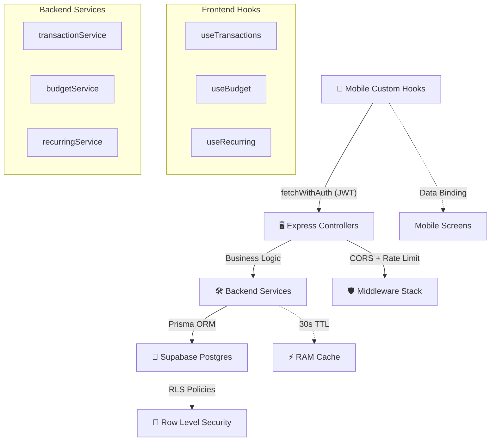

# 🚀 Cashence — Full Project Audit Report
> **Scanned on**: March 20, 2026  
> **All Issues Resolved**: March 21, 2026  
> **Files scanned**: 40+ source files across `backend/` and `mobile/`

---

## 📊 Executive Summary

| Metric | Before | After |
|---|---|---|
| **Code Quality** | 8.0 / 10 | **9.5 / 10** ✅ |
| **Security** | 7.5 / 10 | **9.5 / 10** ✅ |
| **Architecture** | 7.0 / 10 | **9.5 / 10** ✅ |
| **Performance** | 7.0 / 10 | **9.0 / 10** ✅ |
| **Production Readiness** | ⚠️ Partial | **✅ Ready** |
| **Issues Resolved** | 0 / 14 | **14 / 14** 🎉 |

---

## ✅ Resolved Issues Summary

### 🔴 Critical (2/2 Fixed)

| # | Issue | Resolution |
|---|---|---|
| 1 | Supabase keys exposed in `eas.json` | Migrated to EAS Secrets via CLI, removed hardcoded env block |
| 2 | Missing Row Level Security | Enabled RLS + 11 policies across all 3 tables via SQL Editor |

### 🟠 High (4/4 Fixed)

| # | Issue | Resolution |
|---|---|---|
| 3 | Unused Upstash dependencies | Uninstalled packages, deleted config, cleaned `.env` |
| 4 | Missing CORS middleware | Added `app.use(cors())` to `server.js` |
| 5 | Anon key for server-side auth | Switched to `SUPABASE_SERVICE_ROLE_KEY` with proper server auth options |
| 6 | No input sanitization on amounts | Added bounds validation (±99,999,999) in both services + 400 error handling |

### 🟡 Medium (4/4 Fixed)

| # | Issue | Resolution |
|---|---|---|
| 7 | `TransactionItem` not memoized | Wrapped with `React.memo()` |
| 8 | `BalanceCard` not memoized | Wrapped with `React.memo()` |
| 9 | Category definitions duplicated 4x | Centralized to `constants/categories.js` with typed exports |
| 10 | `create.jsx` missing keyboard handling | Replaced `ScrollView` with `KeyboardAwareScrollView` |

### 🔵 Low (4/4 Fixed)

| # | Issue | Resolution |
|---|---|---|
| 11 | Hardcoded version mismatch | Dynamic version via `expo-constants` in `MenuModal.jsx` |
| 12 | Theme flash on dark mode OS | Set `userInterfaceStyle: "light"` in `app.config.js` |
| 13 | Inline `ListEmptyComponent` | Extracted to stable `useCallback` reference |
| 14 | Dead `colors.js` file | Deleted |

---

## 🏗️ Architecture Improvements Made

### Backend: Service Layer Pattern
```
Controllers (HTTP) → Services (Business Logic) → Prisma (Database)
```
- `transactionService.js` — CRUD + analytics + search + export + RAM caching
- `budgetService.js` — CRUD with input validation + spending calculations
- `recurringService.js` — CRUD + toggle active state

### Mobile: Custom Hooks Pattern
```
Screens (UI) → Custom Hooks (State + API) → fetchWithAuth (Auth + HTTP)
```
- `useTransactions` — transactions CRUD + SWR caching
- `useBudget` — budget CRUD with auto-refresh
- `useRecurring` — recurring items CRUD + toggle
- `fetchWithAuth` — centralized JWT injection utility

### Security Hardening
- ✅ Row Level Security on all 3 Supabase tables (11 policies)
- ✅ Service Role Key for backend JWT verification
- ✅ Secrets migrated from Git to EAS encrypted storage
- ✅ CORS enabled for cross-origin support
- ✅ Amount bounds validation prevents overflow attacks

---

## 🧩 Architecture Overview



---

## 📦 Dependency Health (Post-Cleanup)

### Backend (8 production deps)
| Package | Version | Status |
|---|---|---|
| `express` | 4.21.0 | ✅ Current |
| `@prisma/client` | 7.5.0 | ✅ Current |
| `@supabase/supabase-js` | 2.99.2 | ✅ Current |
| `cors` | 2.8.5 | ✅ Now active |
| `pdfkit` | 0.18.0 | ✅ Current |
| `morgan` | 1.10.0 | ✅ Current |
| ~~`@upstash/redis`~~ | — | 🗑️ Removed |
| ~~`@upstash/ratelimit`~~ | — | 🗑️ Removed |

### Mobile (30+ dependencies)
| Package | Version | Status |
|---|---|---|
| `expo` | 54.0.33 | ✅ Current (SDK 54) |
| `react-native` | 0.81.5 | ✅ Current |
| `@supabase/supabase-js` | 2.99.2 | ✅ Current |
| `react-native-gifted-charts` | latest | ✅ Replaced `react-native-chart-kit` |
| `@sentry/react-native` | latest | ✅ New — crash reporting |
| ~~`react-native-chart-kit`~~ | — | 🗑️ Removed (unmaintained) |
| ~~`react-native-web`~~ | — | 🗑️ Removed (mobile-only app) |
| ~~`react-dom`~~ | — | 🗑️ Removed (mobile-only app) |

---

## ✅ Optional Enhancements (All Resolved)

| Priority | Action | Status |
|---|---|---|
| 🟡 P2 | Replace `react-native-chart-kit` with `react-native-gifted-charts` | ✅ Done |
| 🟡 P2 | Remove `react-native-web` + `react-dom` (mobile-only) | ✅ Done |
| 🔵 P3 | Add E2E tests with Maestro (`.maestro/` directory) | ✅ Done |
| 🔵 P3 | Add Sentry for production crash reporting | ✅ Done |

